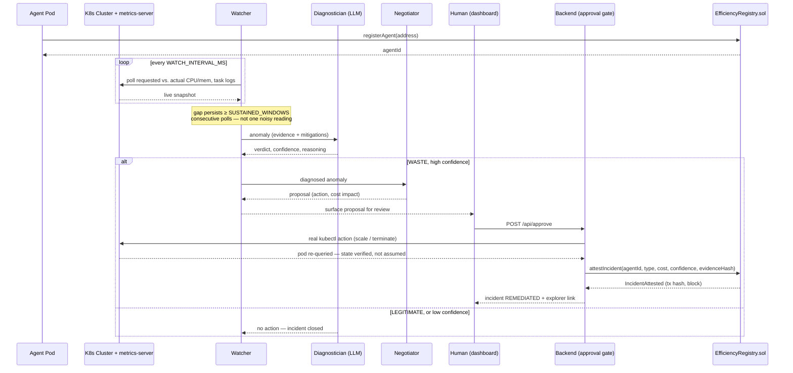

<div align="center">

```
 █████  ██    ██ ████████  ██████  ██████  ██   ██  █████   ██████  ██    ██ 
██   ██ ██    ██    ██    ██    ██ ██   ██ ██   ██ ██   ██ ██        ██  ██  
███████ ██    ██    ██    ██    ██ ██████  ███████ ███████ ██   ███   ████   
██   ██ ██    ██    ██    ██    ██ ██      ██   ██ ██   ██ ██    ██    ██    
██   ██  ██████     ██     ██████  ██      ██   ██ ██   ██  ██████     ██    
```

</div>

**Behavioral waste detection and on-chain efficiency reputation for autonomous agent fleets**

Instead of waiting for a monthly cloud bill to reveal waste, Autophagy sits between an orchestrator and the agent fleet it runs — watching real resource usage, reasoning about *why* a pattern is wasteful (not just flagging a threshold), and the moment a waste incident is confirmed, committing it to an on-chain Efficiency Registry tied to the agent's identity. Like a cell clearing out its own damaged components to stay healthy, the fleet audits and corrects itself — and every agent builds a permanent, portable efficiency record that any other orchestrator or marketplace can check before hiring it.

**Live:** [autophagy.vercel.app](https://autophagy.vercel.app) — the marketing site and Fleet Console frontend. The frontend alone is deployed; point its `AUTOPHAGY_API_URL` at a running backend (see [§ 8](#8-backend--services-apis-and-integration)) to see live data rather than "backend unreachable."

---

## Table of Contents

1. [Problem](#1-problem)
2. [Solution](#2-solution)
3. [How It Works — Full Technical Flow](#3-how-it-works--full-technical-flow)
4. [Detection Foundation](#4-detection-foundation)
5. [System Flow](#5-system-flow)
6. [Tech Stack — What We Use and Why](#6-tech-stack--what-we-use-and-why)
7. [Frontend — Pages, Design, and User Flow](#7-frontend--pages-design-and-user-flow)
8. [Backend — Services, APIs, and Integration](#8-backend--services-apis-and-integration)
9. [Smart Contracts](#9-smart-contracts)
10. [How Everything Connects](#10-how-everything-connects)
11. [Team Split and Responsibilities](#11-team-split-and-responsibilities)
12. [Demo Structure](#12-demo-structure)
13. [Honest Limitations](#13-honest-limitations)
14. [Research and Prior Art](#14-research-and-prior-art)
15. [Docs and References](#15-docs-and-references)
16. [License](#16-license)

---

## 1. Problem

When an orchestrator spins up agents to do work, the only protection against waste is usually nothing at all, or at best a static budget cap:

- Maximum spend per agent
- Maximum runtime
- A dashboard someone checks once a quarter, if ever

These controls only ask one question: **how much has been spent?**

They never ask: **is this agent's behavior actually producing anything?**

An agent stuck retrying a failing task, two agents duplicating the same work, or a provisioned agent nobody remembered to shut down can all sit comfortably under a spending cap while burning real resources for zero output. Nothing in the fleet notices, because nothing is watching *behavior* — only totals.

Three concrete patterns that budget caps miss entirely:

**Pattern 1 — The retry loop.** An agent hits a failing dependency and retries the same task dozens of times. Each attempt is small. None exceeds any per-call limit. The cumulative cost, over hours, is real and entirely invisible until the bill arrives.

**Pattern 2 — The orphaned duplicate.** Two agents, spun up independently, end up working the same task because nothing coordinated them. Both report normal activity. Both are billed. Only one output is ever used.

**Pattern 3 — The forgotten standby.** An agent is provisioned for a burst of work that ends. Nobody tears it down. It sits allocated, technically "idle" rather than "in use," for days, with no annotation distinguishing it from a legitimate reserved resource.

In all three cases, spend is within policy. Behavior is broken. And once the incident is over, there is no record anywhere that this agent has a pattern of doing this — the next team that hires or deploys it starts from zero information, every time.

---

## 2. Solution

Autophagy treats an agent's real resource usage as an ongoing signal, not a one-time budget check, and reasons about *why* a deviation is happening before calling it waste.

A three-agent pipeline sits between the orchestrator and the real cluster:

- **Watcher** continuously polls real, live cluster metrics (requested vs. actual CPU/memory, task logs, retry counts) — no invented numbers, no simulated history.
- **Diagnostician** receives anomalies from Watcher and reasons about intent: is this a legitimate standby, a brand-new agent still warming up, or a genuine waste pattern (retry loop, duplication, dead allocation)? It outputs a verdict with a confidence level and plain-language reasoning, not a bare yes/no.
- **Negotiator** takes a confirmed high-confidence verdict, calculates the real cost impact using current pricing, and proposes a specific fix. Nothing is ever executed silently — every fix requires human approval, because irreversible infrastructure actions should never be fully autonomous.

Once a human approves a verdict, Autophagy commits a lightweight, ERC-8004-pattern attestation on a public testnet, tied to the agent's registered identity: *this agent, this incident type, this cost impact, this timestamp.* Over time this builds a public, checkable **efficiency reputation** for every agent — not just a private note in your own dashboard, but a record any other orchestrator, marketplace, or organization can look up before deciding whether to hire that agent again.

**The gate is behavioral reasoning, not a static threshold. The record is public and tamper-evident, not a private log. This is the part that doesn't exist anywhere else today.**

---

## 3. How It Works — Full Technical Flow

### Step 1 — Agent registers an identity

Every agent in the fleet gets a lightweight on-chain identity (address + metadata) registered in the `EfficiencyRegistry` contract before it starts doing work. This is what any future attestation gets attached to.

### Step 2 — Watcher polls real cluster state

Watcher queries the live Kubernetes API and `metrics-server` on a fixed interval: requested vs. actual CPU/memory per pod, plus lightweight activity logs each demo agent emits itself (task attempts, completions, task IDs). Nothing here is mocked — this is the same data a real production cluster exposes.

### Step 3 — Anomaly detected, handed to Diagnostician

When a sustained gap appears (not a single low reading — a gap that persists across multiple polling windows), Watcher hands the specific pattern to the Diagnostician via a structured handoff: what was requested, what was observed, for how long, and any available context (labels, task logs).

### Step 4 — Diagnostician reasons about intent

The Diagnostician evaluates the pattern against several checks — magnitude of the gap, whether it matches a known waste signature (retry loop, duplicate task ID across agents, zero-activity allocation), and whether there's a plausible legitimate explanation (a "standby" annotation, an agent that only just started). It returns a verdict: `WASTE` or `LEGITIMATE`, a confidence score, and the reasoning behind it in plain language.

### Step 5 — Negotiator calculates impact and proposes a fix

On a high-confidence `WASTE` verdict, the Negotiator computes the real cost using current, publicly published cloud pricing multiplied by the measured over-allocation, and proposes a specific corrective action (scale down, terminate, reassign).

### Step 6 — Human approval gate

Nothing executes automatically. The proposed fix, the reasoning, and the cost figure are surfaced to a human. Only on explicit approval does Autophagy issue the real `kubectl` action against the cluster.

### Step 7 — On-chain attestation

Once approved, Autophagy calls `attestIncident()` on the `EfficiencyRegistry` contract: agent identity, incident type, cost impact, timestamp. This is permanent and publicly queryable — anyone can verify an agent's efficiency history without trusting Autophagy's own dashboard.

### Step 8 — Cluster state actually changes

The approved `kubectl` action executes against the real cluster. Re-querying the cluster immediately after shows the real, changed state — not a claimed one.

---

## 4. Detection Foundation

Autophagy does not use a single hard-coded threshold. It evaluates each anomaly against explicit, explainable constraints:

**Magnitude and duration** — how large is the requested-vs-actual gap, and has it persisted across multiple consecutive polling windows (not just one noisy reading)?

**Pattern match** — does the observed behavior match a known signature?
- *Retry loop*: the same task ID attempted 5 or more times with zero completions.
- *Orphaned duplicate*: two or more agents reporting activity against the same task ID concurrently.
- *Dead allocation*: CPU under 5% of request for the whole window, with zero task activity.
- *Sustained over-allocation*: CPU never exceeds 20% of request across the window, but the pod is doing real work.

**Plausible-intentional check** — is there a signal suggesting the allocation is deliberate (a "standby" label, an agent provisioned only seconds ago where low activity is expected and not yet meaningful)?

**Confidence output** — the Diagnostician does not output a bare flag. It outputs a confidence level and the specific reasoning behind it, so every verdict is explainable on demand, not a black box.

This is deliberately a small, inspectable rule set rather than an opaque model score — every verdict Autophagy produces can be traced back to a specific, statable reason.

---

## 5. System Flow

How one waste incident moves from a live cluster reading to a public, on-chain record — the same eight steps as [Section 3](#3-how-it-works--full-technical-flow), as an actual sequence rather than a box diagram.



---

## 6. Tech Stack — What We Use and Why

### Real Kubernetes Cluster (Minikube / Kind)
The genuine substrate the Watcher observes. Not simulated — real pods, real scheduling, real resource requests.

### metrics-server
Standard Kubernetes component exposing live CPU/memory usage per pod. This is the same tool real production clusters use for autoscaling decisions — Autophagy reads from it, it doesn't re-implement it.

### LLM Reasoning Layer (Diagnostician) — provider-agnostic, Groq by default
Used specifically for the ambiguous judgment call — "is this waste or legitimate" — which a hard-coded threshold cannot answer reliably. This is the genuinely agentic part of the system, not just a decoration on top of a script.

All model calls go through a single OpenAI-compatible `/chat/completions` shape with `response_format: json_schema, strict: true` — the Diagnostician never accepts prose it has to parse. Four providers currently implement that same shape, selected via `LLM_PROVIDER`:

| Provider | Default model | Cost | Billing |
|---|---|---|---|
| `groq` *(default)* | `openai/gpt-oss-120b` | free | No card required |
| `xai` | `grok-4.3` | $1.25 / $2.50 per M tokens | Credits must be purchased |
| `openrouter` | `anthropic/claude-sonnet-4.5` | varies | Credits must be purchased |
| `sarvam` | `sarvam-105b-conversations` | varies | Bring your own key |

Groq is the default specifically because its free tier needs no payment method — switching providers is a config change only (`LLM_PROVIDER` + that provider's API key env var), never application code, so a demo backup can swap models instantly if one provider hits a rate limit live.

```javascript
const response = await fetch(providerBaseUrl + "/chat/completions", {
  method: "POST",
  headers: {
    "Authorization": `Bearer ${apiKey}`,
    "Content-Type": "application/json"
  },
  body: JSON.stringify({
    model, // e.g. "openai/gpt-oss-120b" on Groq, swappable per demo/cost needs
    messages: [
      { role: "system", content: DIAGNOSTICIAN_SYSTEM_PROMPT },
      { role: "user", content: JSON.stringify(anomalyPayload) }
    ],
    response_format: { type: "json_schema", json_schema: VERDICT_SCHEMA, strict: true }
  })
});
```

### EfficiencyRegistry (ERC-8004-pattern contract, on Base Sepolia testnet)
A lightweight identity + attestation registry, following the same shape as ERC-8004's Identity and Validation Registry components. Deployed to **Base Sepolia** (chain ID `84532`) rather than implemented as novel cryptography — the goal is a genuine, verifiable public record, not a custom trust mechanism nobody can audit.

| Base Sepolia detail | Value |
|---|---|
| Chain ID | `84532` |
| Public RPC | `https://sepolia.base.org` |
| Block explorer | `https://sepolia.basescan.org` |
| Faucet | `https://www.coinbase.com/faucets/base-sepolia-faucet` |

Chosen specifically because it's a low-friction, well-supported L2 testnet with a reliable public faucet and explorer — judges can click through to `sepolia.basescan.org` and verify an attestation transaction themselves in real time during the demo.

### kubectl / Kubernetes client
Used by the Negotiator to execute the real, human-approved corrective action against the live cluster.

---

## 7. Frontend — Pages, Design, and User Flow

### Design Principles
Dark, monospace, operations-dashboard aesthetic. Color reserved for status only: green (healthy), amber (under review), red (confirmed waste). Numbers and identifiers in monospace; labels in sans-serif.

### Landing Page (`/`)
The public marketing site — separate from the Fleet Console below, and the first thing a visitor sees. Dark, near-black ground with a neon-yellow accent, classical-statue-meets-modern-tech art direction, GSAP/ScrollTrigger/Lenis-driven scroll animation throughout.

Scrolling past the hero reaches the same pipeline explanation twice, in two different forms depending on viewport: a plain scroll-reveal statement on tablet/mobile, and on desktop, an **animated pipeline diagram** — five nodes (Watcher → Diagnostician → Negotiator → Human Approval → On-chain Attestation) connected by a line that draws itself as you scroll, each node lighting up in sequence. The icons deliberately reuse the Autophagy logo's own circle-and-diamond node vocabulary rather than a generic icon set, so the last node (on-chain attestation) reads as a condensed echo of the logo mark itself. It degrades to a fully-lit static diagram if JavaScript fails to load or the visitor has `prefers-reduced-motion` set, rather than staying half-visible.

### Page 1 — Fleet Overview
Metric cards: total agents watched, incidents flagged today, incidents confirmed, total cost impact this session. Agent list with live status. Scrolling incident feed on the side.

### Page 2 — Agent Detail
Requested-vs-actual usage chart over the observation window. Diagnostician's reasoning trail for any flagged incident. Link to the agent's on-chain efficiency history (public, queryable by anyone).

### Page 3 — Approve / Review
Shows a pending Negotiator proposal: the pattern detected, the reasoning, the calculated cost, and the specific corrective action. One-click approve triggers the real `kubectl` action and the on-chain attestation.

### Page 4 — Demo Page
Two side-by-side panels: a normal agent and a deliberately misbehaving one (real retry-loop script running against the real cluster). A "trigger" button starts the misbehaving agent's real workload; the panel updates live as Watcher, Diagnostician, and Negotiator move through the pipeline in real time.

### Page 5 — How It Works
Static explainer: the problem with budget-only limits, how the reasoning pipeline evaluates ambiguity, and why the attestation is public rather than private.

---

## 8. Backend — Services, APIs, and Integration

### Endpoints

| Endpoint | Purpose |
|---|---|
| `GET /api/health` | Per-dependency status; 503 if the cluster or chain is down |
| `GET /api/watch` | Current cluster snapshot: requested vs. actual usage per pod (`?live=true` forces a fresh read) |
| `POST /api/watch/poll` | Force one full pipeline pass |
| `POST /api/diagnose` | Re-run a verdict by hand — takes a flagged anomaly, returns the Diagnostician's verdict, confidence, and reasoning |
| `POST /api/negotiate` | Takes a confirmed `WASTE` verdict, returns the calculated cost impact and proposed fix |
| `POST /api/approve` | **The human gate.** Executes the real `kubectl` action and calls `attestIncident()` on-chain |
| `POST /api/reject` | Decline a proposal |
| `GET /api/incidents` | All incidents plus session stats |
| `GET /api/agents/:id/history` | Pulls the agent's full on-chain efficiency history for display |
| `GET /api/pods/:name/series` | Utilisation series backing the Agent Detail chart |
| `GET /api/events` | Server-sent event stream (`snapshot`, `incident`) for the live dashboard |

### Data Flow
Watcher polls on an interval → flags anomalies → Diagnostician call → Negotiator call on confirmed waste → human approval → real cluster action + on-chain attestation → history updates.

### Environment Variables

```
# LLM reasoning
OPENROUTER_API_KEY=sk-or-v1-xxxxxxxxxxxxxxxx
OPENROUTER_MODEL=anthropic/claude-sonnet-4.5

# Base Sepolia
BASE_SEPOLIA_RPC_URL=https://sepolia.base.org
BASE_SEPOLIA_CHAIN_ID=84532
EFFICIENCY_REGISTRY_ADDRESS=0x...        # filled in after deployment
BACKEND_SIGNER_PRIVATE_KEY=0x...         # funded via Base Sepolia faucet, server-side only

# Cluster
KUBE_CONTEXT=minikube
```

`OPENROUTER_API_KEY` is never exposed to the frontend — all Diagnostician calls happen server-side. `BACKEND_SIGNER_PRIVATE_KEY` funds and signs the `attestIncident()` transactions and should be a dedicated, minimally-funded testnet wallet only.

---

## 9. Smart Contracts

### EfficiencyRegistry.sol

**Stored per agent:**
```
agentId: address
registeredAt: uint256
incidentCount: uint256
```

**Events:**
- `AgentRegistered(agentId, timestamp)`
- `IncidentAttested(agentId, incidentType, costImpact, timestamp)`

**Functions:**
- `registerAgent(address agentId)` — registers an identity
- `attestIncident(address agentId, string incidentType, uint256 costImpact)` — records a human-approved waste finding, permanently and publicly
- `getHistory(address agentId) returns (Incident[])` — public view function, queryable by anyone, not just Autophagy's own dashboard

This is intentionally a small contract. The goal is a genuine, verifiable public record — not a large or novel cryptographic system built under time pressure.

---

## 10. How Everything Connects

**Frontend → Backend**: dashboard calls backend REST endpoints only; no direct cluster or contract access from the browser.

**Backend → Cluster**: Watcher and Negotiator use the Kubernetes API/`kubectl` directly against the real cluster.

**Backend → LLM**: Diagnostician calls are synchronous requests to the reasoning layer, returning structured verdicts.

**Backend → Chain**: on approval, backend signs and submits the attestation transaction using a funded testnet wallet.

**Chain → Frontend**: agent detail pages read attestation history directly from the contract (or a simple indexer) so the public record is visibly independent of Autophagy's own database.

---

## 11. Team Split and Responsibilities

### Person 1 — Cluster and Detection
Owns Minikube/Kind setup, metrics-server, the deliberately wasteful demo workloads (idle pod, real retry-loop script, duplicate-task pods), and the Watcher polling logic.

### Person 2 — Reasoning and Backend
Owns the Diagnostician's reasoning logic and prompt design, the Negotiator's cost calculation, the Express/Flask API layer, and the human-approval flow.

### Person 3 — Contracts and Frontend
Owns `EfficiencyRegistry.sol`, testnet deployment, the dashboard, the demo page, and rehearsal of the live end-to-end flow.

---

## 12. Demo Structure

**Minute 1 — Show the invisible problem.** Fleet overview looks calm and green. Point out: nothing on a normal dashboard would flag what's about to happen.

**Minute 2 — Force a live polling window.** On the Live Demo page, click "Force a polling window now." `standby-agent` and `dead-allocation-agent` are metrically identical — same reservation, same zero CPU, same empty activity log — yet the Diagnostician splits them: `standby-agent` → LEGITIMATE @ 92% (it declared its own intent), `dead-allocation-agent` → WASTE @ 78% (nothing did). The incident feed below picks up `retry-loop-agent`'s RETRY_LOOP flag in the same pass.

**Minute 3 — Approve and prove it's real.** On the Approve page, click approve. Show the real `kubectl` action landing (re-query the cluster, state has actually changed).

**Minute 4 — Show the public record.** Open `sepolia.basescan.org` live and show the `IncidentAttested` transaction on the deployed registry (`0xFc422Ec82694A5F21D176b1E199b1AEB2deD4Ec9`) — a permanent, public record of this exact incident, checkable by anyone, not just visible in this dashboard. Pull up the agent's own on-chain history to close the loop.

Closing line: *"Budgets check how much was spent. Autophagy checks whether the work was real — and remembers, publicly, when it wasn't."*

Full shot-by-shot script — timecodes, on-screen direction, spoken lines, and exact commands — is in [`DEMO_SCRIPT.md`](./DEMO_SCRIPT.md).

---

## 13. Honest Limitations

This is a testnet proof-of-concept, not a production FinOps platform. The detection rule set is intentionally small and explainable rather than exhaustive — it is built to defensibly catch a few well-defined waste signatures live, not to claim general-purpose coverage. The demo compresses time: waste that would normally accumulate over weeks is created and detected within the hackathon window on a freshly provisioned cluster, and this is disclosed rather than hidden. The on-chain registry mirrors the *pattern* of ERC-8004's Identity and Validation Registries; it is not a claim of formal compliance with a specific, still-maturing standard.

---

## 14. Research and Prior Art

Wasted cloud spend hit 29% in 2026 — the first rise in five years — driven specifically by AI workloads spun up faster than finance teams can tag or shut down ([Flexera, State of the Cloud 2026](https://resources.flexera.com/web/pdf/Flexera-State-of-the-Cloud-Report-2026.pdf)). Independent research backs the shape of that waste: an empirical catalog of 63 LLM-agent budget-overrun incidents across 21 orchestration frameworks names retry loops as a recurring, distinct failure class ([arXiv 2606.04056](https://arxiv.org/pdf/2606.04056)), and field-reported postmortems describe individual agents burning five- and six-figure model spend in hours to days from a single undetected retry loop — caught by the bill, not by anything watching behavior. None of that is hypothetical; it is what Pattern 1–3 in [Section 1](#1-problem) look like at production scale.

Nothing in the existing toolchain closes that gap end-to-end:

| System | What it does | Behavior-aware | Reasons about intent | Auto-remediates | Public reputation |
|---|---|---|---|---|---|
| Cloud dashboards (AWS Cost Explorer, GCP Recommender, Azure Advisor) | Visualizes spend, flags idle/oversized resources against static thresholds | No | No | No | No |
| Kubecost | Attributes Kubernetes cost by namespace/deployment/label, alerts on budgets | No | No | No — surfaces, doesn't fix | No |
| CAST AI and similar autoscalers | Continuously rightsizes pods, bin-packs nodes, automates spot placement | Generic | No | Yes, silently | No |
| Agent budget guardrails (token caps, circuit breakers) | Kills or throttles a session once a cost ceiling is crossed | Reactive only | No | Kill switch only | No |
| ERC-8004 reputation apps (general agent-identity projects) | Portable on-chain identity and feedback registries | No | No | No | Generic feedback |
| **Autophagy** | Watches live cluster behavior, has an LLM diagnose intent, remediates on human approval, attests the outcome on-chain | **Yes — 4 signatures** | **Yes, with confidence** | **Yes, human-gated** | **Yes, portable** |

Cloud cost tooling detects infrastructure waste at scale but treats it as a private, single-organization concern — nothing makes an agent's efficiency track record portable or checkable by a different organization deciding whether to hire it. ERC-8004 is real, adopted infrastructure, not a hackathon-only conceit — it went live on Ethereum mainnet on January 29, 2026 and was adopted on Avalanche and BNB Chain within weeks — but an empirical study of the live ecosystem through May 2026 confirms its Validation Registry is used for generic feedback, not resource-efficiency-specific attestation ([arXiv 2606.26028](https://arxiv.org/html/2606.26028)). Autophagy's contribution is applying that attestation pattern specifically to *resource-efficiency behavior*, which no existing FinOps tool or agent-identity project currently records publicly.

---

## 15. Docs and References

| Topic | URL |
|---|---|
| Kubernetes metrics-server | `https://github.com/kubernetes-sigs/metrics-server` |
| Minikube | `https://minikube.sigs.k8s.io/docs/` |
| ERC-8004 | `https://eips.ethereum.org/EIPS/eip-8004` |
| Kubernetes resource management | `https://kubernetes.io/docs/concepts/configuration/manage-resources-containers/` |
| Groq console (default LLM provider, free tier) | `https://console.groq.com/keys` |
| OpenRouter API docs | `https://openrouter.ai/docs` |
| OpenRouter model list | `https://openrouter.ai/models` |
| Base Sepolia docs | `https://docs.base.org/network-information` |
| Base Sepolia faucet | `https://www.coinbase.com/faucets/base-sepolia-faucet` |
| Base Sepolia explorer | `https://sepolia.basescan.org` |

---

## 16. License

MIT — see [`LICENSE`](./LICENSE).

---

*Built for Tenori × Stateless × LICET Hackathon 2026 — Track 2: Agentic Web, Swarms & Harnesses*
*Autophagy — a fleet that audits and heals its own waste, and remembers it publicly.*
